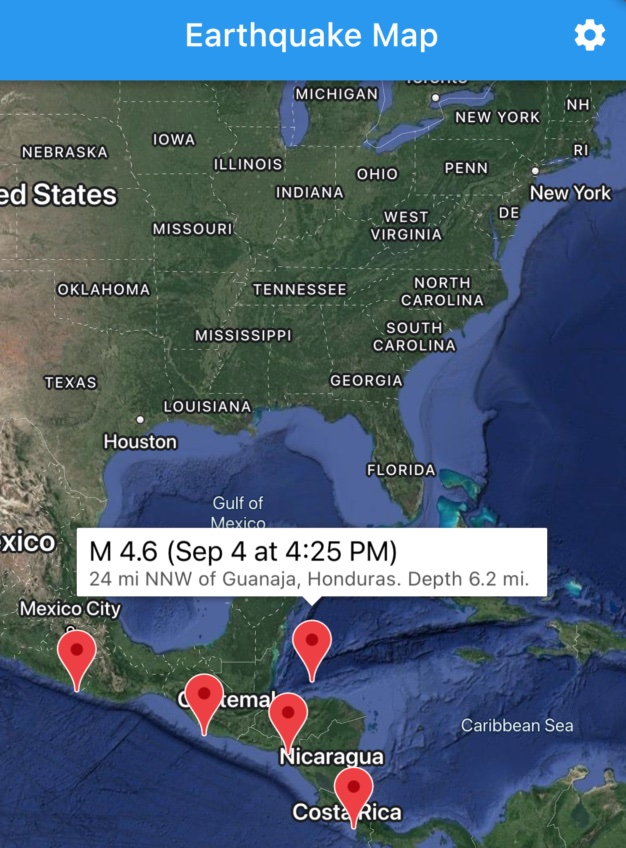

# Earthquake map

 

This a demo [Flutter](https://flutter.dev/) app coded in
[Dart](https://dart.dev/) for showing earthquakes on a map.

The project is a part of the
[geospatial_demos](https://github.com/navibyte/geospatial_demos) that
is a companion demo code repository for the 
[Geospatial tools for Dart](https://github.com/navibyte/geospatial).

Edits for this sample app:
* 📅 2022-08-29 (the first version)
* ✍️ 2022-09-04 (last updated)

## :sparkles: Introduction

Shows earthquakes fetched from the [USGS web service](https://earthquake.usgs.gov/earthquakes/feed/) on a basic map view.

Coding topics:
* **State management** (settings, query filters, Web API data access, presentation formatters, map view markers).
* Using a **Web API client to access geospatial data** formatted as [GeoJSON](https://geojson.org/) feature and geometry objects.
* Visualizing earthquakes (that are geospatial feature entities with point geometries) as **map markers on a map view**.

Notes:
* The UI of this sample app is very basic. The app focuses on a clean demonstration of the topics mentioned above.
* To run this demo, you need to obtain and configure an API key for Google Maps.
* Supported platforms: only iOS and Android

Dart packages utilized:
* [equatable](https://pub.dev/packages/equatable): equality and hash utils
* [geobase](https://pub.dev/packages/geobase): geospatial data structures and vector data support for GeoJSON
* [geodata](https://pub.dev/packages/geodata): fetching a Web API with GeoJSON data
* [intl](https://pub.dev/packages/intl): localized date formatting
* [state_notifier](https://pub.dev/packages/state_notifier): helps manipulating a state object with multiple ways to update it 

Flutter packages utilized:
* [flutter_riverpod](https://pub.dev/packages/flutter_riverpod): an efficient and straightforward state management library (see also [Riverpod](https://riverpod.dev/) docs)
* [google_maps_flutter](https://pub.dev/packages/google_maps_flutter): a map view widget for iOS and Android platforms (Note: an API key must be configured)

## ⚙️ Setup

The demo app requires at least [Dart](https://dart.dev/) SDK 2.17 and [Flutter](https://flutter.dev/) SDK 3.0.

Check instructions to setup [Google Maps for Flutter](https://pub.dev/packages/google_maps_flutter). At least you must change API keys on:

- android/app/src/main/AndroidManifest.xml
    - manifest -> application
        - `<meta-data android:name="com.google.android.geo.API_KEY" android:value="<YOUR-APIKEY>"/>`
- ios/Runner/AppDelegate.swift
    - AppDelegate -> application
        - `GMSServices.provideAPIKey("<YOUR-APIKEY>")`

## 📚 Code files

* lib/
  * src/
    * data/earthquakes/
      * [earthquake_model.dart](lib/src/data/earthquakes/earthquake_model.dart) (the earthquake entity class as represented by a client-side repository)  
      * [earthquake_presentation.dart](lib/src/data/earthquakes/earthquake_presentation.dart) (the provider for a formatter function producing text representations of earthquakes) 
      * [earthquake_query.dart](lib/src/data/earthquakes/earthquake_query.dart) (the query model class and enums, and the state notifier provider for query filters)      
      * [earthquake_repository.dart](lib/src/data/earthquakes/earthquake_repository.dart) (the future provider to access feature items from the USGS earthquake service)
      * [earthquake_view_model.dart](lib/src/data/earthquakes/earthquake_view_model.dart) (the provider providing a view model with a set of earthquake marker objects)
    * map/
      * [map_view.dart](lib/src/map/map_view.dart) (the map view showing Google Maps and earthquakes as markers)
    * preferences/
      * [units.dart](lib/src/preferences/units.dart) (the state proviver for a preference of the unit system)
    * settings/
      * [settings_view.dart](lib/src/settings/settings_view.dart) (the settings view shows a selection for units and filter parameters)
    * utils/
      * [strings.dart](lib/src/utils/strings.dart) (utility functions for String manipulation)
  * [main.dart](lib/main.dart) (the app widget showing the main view with a map)

## :house_with_garden: Authors

This project is authored by [Navibyte](https://navibyte.com).

More information and other links are available at the
[geospatial_demos](https://github.com/navibyte/geospatial_demos) repository
from GitHub. 

## :copyright: License

This project is licensed under the "BSD-3-Clause"-style license.

Please see the 
[LICENSE](https://github.com/navibyte/geospatial_demos/blob/main/LICENSE).